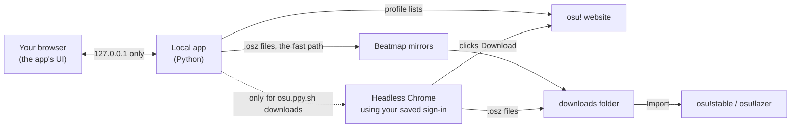

<div align="center">


# osu! Beatmap Downloader

**Bulk-download osu! beatmaps in the background, then import them into osu! in one click.**

Your most played maps, a friend's favourites, or any list of IDs, hundreds at a time,
with a simple app that runs on your own PC.

[](https://github.com/AustinKol/osubeatmapdownloader/releases/latest)


[](LICENSE)

<picture>
  <source media="(prefers-color-scheme: light)" srcset="docs/images/hero-light.png">
  
</picture>

</div>

---

## Motivation

Back in 2020, a hard drive failure wiped out my entire osu! beatmap collection. Luckily, osu! keeps a record of
every beatmap you've played at least once, ranked from most played to least played. I wrote a few scripts to pull
the beatmap list from my profile, and used Selenium and ChromeDriver to download them. I was overjoyed that I got my whole library back!

For years those scripts stayed on my PC. I never got around to building a proper interface or releasing them until now.
With the help of Claude Code, I quickly made a simple HTML interface so that others can enjoy it too,
without needing any coding knowledge.

So far, this is still the best way that I know of to recover lost beatmaps folders. This tool is also a great way to download anyone else's maps, like your favourite pro player's most played list.

> [!NOTE]
> **Where maps come from is your choice.** By default the app uses public **beatmap mirrors**
> (catboy.best, osu.direct, beatconnect.io, nerinyan.moe), which need no osu! account and have no
> hourly limit. Switch *Download from* to **osu.ppy.sh** in *Folders & options* to fetch every map
> from the official site using your own account instead.

## Features

- **Grab whole lists at once.** A player's *most played*, *favourites*, *ranked*, *loved*, *guest* or *graveyard* maps, or a shared **[osu!collector](https://osucollector.com) collection** — a farm list, a tournament pool, a friend's favourites. You can also paste IDs/links or open a `.txt` a friend sent you.
- **Turn a playlist into beatmaps.** Paste songs (or a Spotify playlist exported to CSV) and the app finds the beatmap for each one, showing you its pick and the alternatives so you can correct it before downloading.
- **Top N, not everything.** *Most played* is ordered by play count, so *How many* gives you exactly your top N maps, with the play count shown on every row. Or set a **minimum play count** and take everything you actually played.
- **Fast by default.** Maps come from public **beatmap mirrors**: no sign-in, no browser and no hourly limit, which is roughly **ten times faster**. Switch to official osu.ppy.sh downloads whenever you prefer.
- **Runs invisibly.** When the website is used, Chrome works in the background (headless). No windows popping up, no need to close your browser first.
- **Skips what you already have.** Maps in your **osu!lazer library**, your osu!stable `Songs` folder, the download folder, or downloaded in an earlier session. Even maps too old to carry a beatmap ID, which are matched by artist, title and mapper.
- **Signs in through your own browser.** No separate Chrome window to hunt for, and nothing to do at all if you're already signed in to osu! there.
- **Picks up where it left off.** The queue is saved, so closing the app mid-run doesn't lose your place.
- **Checks its work.** osu!lazer can accept a beatmap and quietly not import it, so the app looks afterwards and tells you which ones didn't arrive.
- **Tells you the size first.** *Estimate size* samples a few maps and says how much disk the queue needs, and how much you have.
- **Never hangs on one map.** A download that stops making progress for 10 seconds is abandoned and the next mirror is tried, so one bad server can't stall a long queue.
- **Tells you when it's done.** A desktop notification at the end of a long run.
- **One-click import** into **osu!stable** or **osu!lazer**, or automatically as each map finishes. Imports go over in batches, and anything osu! refuses is reported and kept for a retry rather than quietly dropped.
- **Handles osu!'s hourly limit for you.** If you download from osu.ppy.sh and it stops accepting downloads, the app waits and retries on its own, and the time estimate includes those waits. Pause, resume, stop and retry failed maps any time.
- **Portable.** Unzip and run. Settings, downloads and everything else stay inside the app's folder.
- **Share your library.** Export your Songs folder as an ID list your friends can load.

## Download

1. Install [Google Chrome](https://www.google.com/chrome/) if you don't have it.
2. Download **`osu-beatmap-downloader-win64.zip`** from the [latest release](https://github.com/AustinKol/osubeatmapdownloader/releases/latest).
3. Unzip it anywhere you like (not *Program Files*), open the folder and double-click **`osu! Beatmap Downloader.exe`**.

> [!NOTE]
> The app isn't code-signed, so Windows SmartScreen may say it *protected your PC*.
> Click **More info → Run anyway**. The full source is right here if you'd like to check it, or you can [run it from source](#run-from-source).

A black window opens (that's the app: keep it open while downloading and close it to quit) and your browser shows the interface.

> [!IMPORTANT]
> **This applies to official downloads only** — mirrors have no such limit.
> **osu! allows about 200 beatmap downloads per hour** (osu!supporters get more). This is a limit on osu!'s side,
> and since every map comes from osu.ppy.sh, the app respects it. When you reach it, the app waits and retries
> automatically after **5, 10, 20 and 25 minutes** (an hour in total), then carries on, repeating that cycle if it's
> still blocked. Big batches therefore take roughly **an hour per 200 maps**: 1,000 maps is about 5 hours. Just leave
> it running; nothing is skipped, and the time-left estimate already includes the waits.

## How to use it

### 1. Sign in to osu! *(only for official downloads)*

Mirror downloads need no osu! account, so you can skip to step 2. Sign in if you chose **osu.ppy.sh**
as the source, or to let the app fall back to it for maps no mirror has.

Click **Sign in with osu!** and osu! opens **in a new tab of the browser you're already using**. Sign in there
(including the captcha and any email code osu! asks for), then come back and click **I've signed in**. The app
copies just your `osu.ppy.sh` session cookie out of your browser into its own, so downloads can use it. If
you're already signed in to osu! in that browser, the whole step happens in one click with no tab at all.

This works with Firefox-family browsers (Firefox, Zen, LibreWolf, Floorp, Waterfox), which keep cookie values
in plain text. Chromium-based browsers encrypt theirs, so for those the app falls back to opening **its own
Chrome window** on a private profile, where the session stays. You can pick that route yourself at any time
with *Use a separate Chrome window instead*. Either way you stay signed in for about a month.


The app doesn't control that window or read what you type.

> [!WARNING]
> Your sign-in is saved in the app's `data\` folder, so treat that folder like a password: don't share or upload
> it. **Sign out** (top right) deletes the saved sign-in.

### 2. Choose beatmaps

Type a player name (or leave it empty for yourself), pick a list and how many maps you want. Or switch
to **From a collection** and paste an [osu!collector](https://osucollector.com) link, to **From a playlist**
and paste songs, or to **From a list** and paste IDs or links.

<details>
<summary><b>From a playlist (Spotify and friends)</b></summary>

<br>

Paste a **Spotify playlist link** and the app reads it directly. That needs a free Spotify app of your
own — make one at [developer.spotify.com/dashboard](https://developer.spotify.com/dashboard) and put its
*Client ID* and *Client secret* in **Folders & options → Spotify**. Spotify requires this even for public
playlists, and it won't share its own editorial playlists with an app at all.

Or skip that entirely: export a playlist to CSV with a tool like [Exportify](https://exportify.net) and
paste it in, or just type `Artist - Title` lines. Every song is searched on osu! and the most played
matching beatmap is picked.

**Check the picks before queueing.** A search can't tell a song from its remix, its TV-size cut or a cover,
so each row has a dropdown with the other candidates (mapper, play count and ranked status shown) and a
tick box to leave a song out. Songs with no convincing match are left unticked for you. The badge on each
row says how well the names actually agreed: *good*, *check* or *unsure*, and **Tick good only** / **Tick
all** / **Untick all** handle a long playlist in one go.

Nothing is downloaded until you press **Add to queue**, and everything you already own is skipped as usual.

</details>

**Most played** is ordered by play count, highest first, so *How many* = **your top N most played maps**.
Set it to 50 for a quick refresher, or to a few thousand to pull a whole library back. Each row shows how
many times you played the map, so you can see where the list is cut off.

**Min. plays** cuts the list by play count instead of by a fixed number: set it to `5` to get every map
you played at least five times, however many that turns out to be. `0` turns it off.

**Game mode**, **difficulty** and **ranked only** narrow it further — useful when rebuilding a library,
since there's no point pulling mania maps you'll never open. A set is kept if any of its difficulties
fits, because downloading a set brings all of them.

> [!TIP]
> **Recovering a lost library?** Choose **Most played**. It includes every beatmap you've played at least once, so
> leave Player empty and set *How many* high enough to cover your whole collection.

Open **Folders & options** to choose the download source and where maps are saved, and to pick which
osu! to import into. The app finds your **osu!lazer library** on its own and skips anything already in
it; point it at an osu!stable `Songs` folder to skip those too.


<details>
<summary><b>Mirrors or osu.ppy.sh?</b></summary>

<br>

**Mirrors are the default and much faster.** They're community servers hosting the same `.osz`
files, so no osu! account, no browser and no hourly limit are involved: about **1.5 seconds per
map** instead of an hour per 200. The app uses catboy.best, osu.direct, beatconnect.io and
nerinyan.moe, so one being down doesn't stop a run.

Which mirror is quickest changes through the day, and a mirror that is merely *slow* would
otherwise be used forever, so the app times every download and puts the fastest one first.
The difference is worth having: on one run here the default mirror had dropped to 0.4 MB/s
while another was serving the same files at 7 MB/s.

It sticks with the winner rather than re-testing constantly: one other mirror is re-checked
every 40 downloads, a download crawling far behind a mirror known to be quicker is abandoned
for it, and the measurements are saved so a restart doesn't start from scratch. Where a mirror
publishes a request budget (catboy.best sends `X-RateLimit-*`), the app keeps within it.

**Seconds between maps** is a minimum gap between *requests*, not an extra pause tacked onto
each one, so a download that already took longer than the gap isn't followed by more waiting.
Lower it only if you know the mirror is happy with it.

Choose **osu.ppy.sh** if you'd rather every map come from the official site through your own
account. It's slower and capped, but it's exactly what clicking Download on the website does.

With mirrors selected you can also tick **Fall back to osu.ppy.sh**, which fetches anything no
mirror has (very new or unranked maps) through the website. That needs you to be signed in.

</details>

<details>
<summary><b>osu!stable or osu!lazer?</b></summary>

<br>

**osu!stable is recommended.** osu!lazer stores beatmaps as files named by their SHA-256 hash, so there's no
normal `Songs` folder you can browse, back up or share. Importing into stable keeps regular song folders, and
lazer can still use them: in lazer, go to **Settings → Maintenance** and import from your stable install.

The app finds both automatically (wherever they're installed). If it can't, click **Locate…** and pick the folder
that contains `osu!.exe`. If the one you chose isn't installed, it falls back to the other.
</details>

### 3. Download

Hit **Download**. You can minimise the tab while the list, progress bar and time estimate keep updating. If osu!'s hourly
limit kicks in, the status line shows when the next retry happens.


When it's done, click **Import all into osu!** (or tick *Import as they finish* beforehand). Anything that failed can be retried or saved as a list.


## Troubleshooting

| Problem | Fix |
|---|---|
| **A long fetch or match is taking too long** | Press **Cancel** next to the spinner. Anything already found is kept. |
| **Can't find a map in a long queue** | The search box above the list filters by artist, title or ID; it appears once the queue passes 15 maps. |
| **Can't change the download folder** | Not while a download is running — the running job already has the old path. Stop it first. |
| **A playlist song matched the wrong map** | Pick a different one from that row's dropdown, or untick the row. The list is sorted by how well the names matched and how played each map is. |
| **A collection has maps nothing can download** | osu!collector collections can contain maps that were never submitted to osu!. The app says how many and skips them; they don't exist on any mirror. |
| **"No mirror has this beatmap"** | Very new, unranked or deleted maps may not be mirrored yet. Tick **Fall back to osu.ppy.sh** (and sign in) to fetch those from the website. |
| **osu!lazer says "IPC took too long"** | A lazer that was already running stopped accepting imports. Close and reopen lazer; the maps stay in the download folder, so **Import all into osu!** picks them up. |
| **Downloads got slow after a while** | A mirror has throttled or is busy. The app measures each one and switches to the quickest by itself, re-checking every 10 minutes; the *Activity log* names the mirror in use and its speed. |
| **A map seems stuck** | It gives up on its own after 10 seconds without progress and moves to the next mirror. Change that with **Give up if stuck for** in *Folders & options*. Big maps are safe: the clock measures time *without data*, not total download time. |
| **Maps in lazer aren't being skipped** | Press **Scan** next to *osu!lazer library*. If it says the folder wasn't found, set it manually — it's the folder holding `files` and `client.realm`. |
| **A few old maps still aren't skipped** | Maps saved before osu! file format v10 carry no beatmap ID. Press **Look up names** and the app fetches each one's details and matches it by checksum, which is exact and survives a mapper renaming themselves. |
| **"Couldn't find an osu! sign-in in your browser"** | Sign in to osu! in your browser first, or use *Use a separate Chrome window instead*. Chromium-based browsers encrypt their cookies and always need that route. |
| **"No download button"** for some maps | Turn on **Show explicit content** in your [osu! account settings](https://osu.ppy.sh/home/account/edit). Otherwise the map may have been removed. |
| **"osu!'s hourly download limit reached"** | Expected after about 200 maps in an hour. The app retries the same map after 5, 10, 20 and 25 minutes and continues once osu! allows it, so just leave it running. Skipping to other maps doesn't help: the limit is per account, not per map. |
| **"You're signed out of osu!"** | Your saved sign-in expired (after about a month) or you signed out. Click **Sign in with osu!** again. |
| **The sign-in window doesn't appear** | Check your taskbar for a new Chrome window. Google Chrome must be installed. |
| **Chrome won't start** | Make sure Google Chrome is installed and up to date. The first run needs internet to fetch a matching ChromeDriver. |
| **"No Chromium-based browser found"** (Linux) | Install Chrome or Chromium from your package manager. A Flatpak/Snap browser can't be used; set `OBD_CHROME=/path/to/browser` for anything unusual. |
| **ChromeDriver version mismatch** (Linux) | Your distro's Chromium is newer or older than any driver online. Install your distro's `chromedriver` package: the app prefers it when its version matches. |
| **Browse… does nothing** (Linux) | Install `zenity` or `kdialog`, or just type the path into the box. |
| **Can't save settings** | The app's folder must be writable, so don't put it in *Program Files*. (It will fall back to `%LOCALAPPDATA%\osu! Beatmap Downloader`.) |
| **Want to see what the browser is doing** | *Folders & options* → **Show the browser**. The *Activity log* at the bottom also shows every step. |

## How it works



Mirrors serve `.osz` files over ordinary HTTP, so that path is a plain download with no browser involved.

osu! itself doesn't hand out direct download links to scripts, so for official downloads the app does what
you'd do by hand: a hidden Chrome opens each beatmap page and clicks **Download**.
[Selenium](https://www.selenium.dev/) controls Chrome and fetches a matching ChromeDriver automatically.
Chrome is only started if a download actually needs it.

Everything stays on your machine. The interface is served only on `127.0.0.1`, requests from other websites are
rejected, and your osu! session is only ever sent to osu!'s own servers (`*.ppy.sh`).

Sign-in normally happens in your own browser, and the app then reads only the `.ppy.sh` cookies out of that
browser's `cookies.sqlite` and injects them into its Chrome profile in `data\`. No other site's cookies are
touched, and the database is copied before reading so a running browser isn't disturbed.

Where that isn't possible (Chromium-based browsers encrypt their cookie store), sign-in happens in a plain Chrome
window with its own profile inside `data\`. osu!'s login page uses a Cloudflare captcha that fails in automated
browsers (even one with just a debugging port open), so nothing is attached to that window. When you're done, the
app closes it normally and checks the profile with headless Chrome. Downloads reuse the same profile.

### Portable folder layout

```
osu! Beatmap Downloader\
├── osu! Beatmap Downloader.exe
├── README.txt
├── runtime\      the app itself (Python, Selenium, UI)
├── data\         settings, saved sign-in (Chrome profile), download history, saved queue, ChromeDriver
└── downloads\    .osz files waiting to be imported
```

Move the folder to move the app; delete it to uninstall. (Running from source, `data/` and `downloads/`
sit in the project folder the same way.)

## Run from source

Requires Python 3.10+ and Google Chrome.

```bash
git clone https://github.com/AustinKol/osubeatmapdownloader.git
cd osubeatmapdownloader
```

On Windows, double-click **`start.bat`**. On Linux and macOS, run **`./start.sh`**. Either one creates a
virtual environment, installs dependencies and opens the app. By hand:

```bash
python3 -m venv .venv
.venv/bin/pip install -r requirements.txt
.venv/bin/python app.py
```

Options: `--port 1234` to use another port, `--no-browser` to not open a tab. `--help` lists the rest.

It can also run without the interface, for a scheduled job or a script:

```bash
python app.py --collection https://osucollector.com/collections/23333 --start
python app.py --profile Hex110 --limit 500 --min-plays 5 --exit-when-done
python app.py --list maps.txt --exit-when-done
python app.py --spotify https://open.spotify.com/playlist/… --confident-only --start
```

`--exit-when-done` quits once the queue finishes, so it works in cron. `--spotify` and `--songs`
match songs to beatmaps with nobody there to confirm them, so they warn about loose matches;
`--confident-only` queues just the ones whose names clearly agree.

### Linux notes

You need a **Chromium-based browser the app can launch directly**:

```bash
sudo pacman -S chromium      # Arch
sudo apt install chromium    # Debian/Ubuntu
sudo dnf install chromium    # Fedora
```

Google Chrome, Chromium, Brave, Vivaldi and Edge are all found automatically. A **Flatpak or Snap
browser will not work**, because the app has to start the browser itself and drive it with a matching
ChromeDriver. If your browser lives somewhere unusual, point the app at it:

```bash
OBD_CHROME=/opt/my-browser/chrome ./start.sh
```

**Importing into osu!:**

- **osu!lazer** is detected automatically, whether it came from your distro's package (`osu-lazer`), an
  AppImage in `~/Applications`, `/opt/osu-lazer/`, or Flatpak (`sh.ppy.osu`).
- **osu!stable** only runs under Wine, so the app looks for `osu!.exe` in the usual prefixes
  (`~/.wine`, `osu-winello`'s prefix, `~/Games/osu!`) and launches it with `wine`. If it's elsewhere, use
  **Locate…** and pick the folder containing `osu!.exe`. On a machine with no osu!stable, the app
  defaults to lazer on first run.

Folder pickers use **zenity** or **kdialog**; install either one if the *Browse…* buttons do nothing.
(Most distros ship Python without `tkinter`, so the Windows picker isn't available.) You can always
type a path into the box instead.

### Building a release

Double-click **`build.bat`**. It produces:

- `dist\osu! Beatmap Downloader\`: the portable app folder
- `dist\osu-beatmap-downloader-win64.zip`: that folder zipped, ready to attach to a GitHub release

### Project layout

| Path | What it is |
|---|---|
| [`app.py`](app.py) | Local web server and the actions behind every button |
| [`osu_core.py`](osu_core.py) | osu! profile lists, osu!collector collections, beatmap mirrors, headless Chrome downloader, osu!stable/lazer detection and library scanning |
| [`web/index.html`](web/index.html) | The whole interface, in plain HTML, CSS and JavaScript |
| [`build.bat`](build.bat) · [`tools/`](tools) · [`assets/`](assets) | Release packaging (PyInstaller) and the app icon |
| [`start.bat`](start.bat) · [`start.sh`](start.sh) | Run-from-source launchers for Windows, and for Linux/macOS |
| [`tests/`](tests) | `python -m unittest discover -s tests` — standard library only, no network |

## Contributing

Run the tests before sending a change: `python -m unittest discover -s tests`. They need no
network and no osu! install, and they take about fifteen seconds. See [`tests/`](tests).

Issues and pull requests are welcome. If osu! changes its website and downloads stop working, the download-button
lookup lives in `CLICK_DOWNLOAD_JS` in [`osu_core.py`](osu_core.py).

## Disclaimer

Not affiliated with or endorsed by ppy Pty Ltd. "osu!" is a trademark of ppy Pty Ltd. Please be considerate of
osu!'s servers: keep the default delays and don't download more than you'll play.

## License

[MIT](LICENSE)
