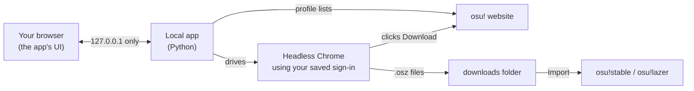

<div align="center">


# osu! Beatmap Downloader

**Bulk-download osu! beatmaps in the background, then import them into osu! in one click.**

Your most played maps, a friend's favourites, or any list of IDs, hundreds at a time,
with a simple app that runs on your own PC.

[](https://github.com/AustinKol/osubeatmapdownloader/releases/latest)


[](LICENSE)

<picture>
  <source media="(prefers-color-scheme: light)" srcset="docs/images/hero-light.png">
  
</picture>

</div>

---

## Motivation

Back in 2020, a hard drive failure wiped out my entire osu! beatmap collection. Luckily, osu! keeps a record of
every beatmap you've played at least once, ranked from most played to least played. I wrote a few scripts to pull
the beatmap list from my profile, and used Selenium and ChromeDriver to download them. I was overjoyed that I got my whole library back!

For years those scripts stayed on my PC. I never got around to building a proper interface or releasing them until now.
With the help of Claude Code, I quickly made a simple HTML interface so that others can enjoy it too,
without needing any coding knowledge.

So far, this is still the best way that I know of to recover lost beatmaps folders. This tool is also a great way to download anyone else's maps, like your favourite pro player's most played list.

> [!NOTE]
> **All beatmaps are downloaded directly from [osu.ppy.sh](https://osu.ppy.sh), the official osu! website,
> using your own account.** No third-party mirrors or other download sites are used.

## Features

- **Grab whole lists at once.** A player's *most played*, *favourites*, *ranked*, *loved*, *guest* or *graveyard* maps. You can also paste IDs/links or open a `.txt` a friend sent you.
- **Top N, not everything.** *Most played* is ordered by play count, so *How many* gives you exactly your top N maps, with the play count shown on every row.
- **Runs invisibly.** Chrome works in the background (headless). No windows popping up, no need to close your browser first.
- **Skips what you already have.** Maps in your osu!stable `Songs` folder, in the download folder, or downloaded in an earlier session.
- **One-click import** into **osu!stable** or **osu!lazer**, or automatically as each map finishes.
- **Official downloads only.** Every map comes straight from osu.ppy.sh, exactly as if you clicked Download yourself.
- **Handles osu!'s hourly limit for you.** When osu! stops accepting downloads, the app waits and retries on its own, and the time estimate includes those waits. Pause, resume, stop and retry failed maps any time.
- **Portable.** Unzip and run. Settings, downloads and everything else stay inside the app's folder.
- **Share your library.** Export your Songs folder as an ID list your friends can load.

## Download

1. Install [Google Chrome](https://www.google.com/chrome/) if you don't have it.
2. Download **`osu-beatmap-downloader-win64.zip`** from the [latest release](https://github.com/AustinKol/osubeatmapdownloader/releases/latest).
3. Unzip it anywhere you like (not *Program Files*), open the folder and double-click **`osu! Beatmap Downloader.exe`**.

> [!NOTE]
> The app isn't code-signed, so Windows SmartScreen may say it *protected your PC*.
> Click **More info → Run anyway**. The full source is right here if you'd like to check it, or you can [run it from source](#run-from-source).

A black window opens (that's the app: keep it open while downloading and close it to quit) and your browser shows the interface.

> [!IMPORTANT]
> **osu! allows about 200 beatmap downloads per hour** (osu!supporters get more). This is a limit on osu!'s side,
> and since every map comes from osu.ppy.sh, the app respects it. When you reach it, the app waits and retries
> automatically after **5, 10, 20 and 25 minutes** (an hour in total), then carries on, repeating that cycle if it's
> still blocked. Big batches therefore take roughly **an hour per 200 maps**: 1,000 maps is about 5 hours. Just leave
> it running; nothing is skipped, and the time-left estimate already includes the waits.

## How to use it

### 1. Sign in to osu!

osu! only lets signed-in players download maps. Click **Sign in with osu!** and a Chrome window opens on osu!'s own
sign-in page. Sign in there (including the captcha and any email code osu! asks for), then click **I've signed in**
in the app, or just close that window. The app checks with osu! and shows your name. You stay signed in for
about a month.


The app doesn't control that window or read what you type.

> [!WARNING]
> Your sign-in is saved in the app's `data\` folder, so treat that folder like a password: don't share or upload
> it. **Sign out** (top right) deletes the saved sign-in.

### 2. Choose beatmaps

Type a player name (or leave it empty for yourself), pick a list and how many maps you want. Or switch to **From a list** and paste IDs or links.

**Most played** is ordered by play count, highest first, so *How many* = **your top N most played maps**.
Set it to 50 for a quick refresher, or to a few thousand to pull a whole library back. Each row shows how
many times you played the map, so you can see where the list is cut off.

> [!TIP]
> **Recovering a lost library?** Choose **Most played**. It includes every beatmap you've played at least once, so
> leave Player empty and set *How many* high enough to cover your whole collection.

Open **Folders & options** to choose where maps are saved, point the app at your osu!stable `Songs` folder so it skips maps you own, and pick which osu! to import into:


<details>
<summary><b>osu!stable or osu!lazer?</b></summary>

<br>

**osu!stable is recommended.** osu!lazer stores beatmaps as files named by their SHA-256 hash, so there's no
normal `Songs` folder you can browse, back up or share. Importing into stable keeps regular song folders, and
lazer can still use them: in lazer, go to **Settings → Maintenance** and import from your stable install.

The app finds both automatically (wherever they're installed). If it can't, click **Locate…** and pick the folder
that contains `osu!.exe`. If the one you chose isn't installed, it falls back to the other.
</details>

### 3. Download

Hit **Download**. You can minimise the tab while the list, progress bar and time estimate keep updating. If osu!'s hourly
limit kicks in, the status line shows when the next retry happens.


When it's done, click **Import all into osu!** (or tick *Import as they finish* beforehand). Anything that failed can be retried or saved as a list.


## Troubleshooting

| Problem | Fix |
|---|---|
| **"No download button"** for some maps | Turn on **Show explicit content** in your [osu! account settings](https://osu.ppy.sh/home/account/edit). Otherwise the map may have been removed. |
| **"osu!'s hourly download limit reached"** | Expected after about 200 maps in an hour. The app retries the same map after 5, 10, 20 and 25 minutes and continues once osu! allows it, so just leave it running. Skipping to other maps doesn't help: the limit is per account, not per map. |
| **"You're signed out of osu!"** | Your saved sign-in expired (after about a month) or you signed out. Click **Sign in with osu!** again. |
| **The sign-in window doesn't appear** | Check your taskbar for a new Chrome window. Google Chrome must be installed. |
| **Chrome won't start** | Make sure Google Chrome is installed and up to date. The first run needs internet to fetch a matching ChromeDriver. |
| **"No Chromium-based browser found"** (Linux) | Install Chrome or Chromium from your package manager. A Flatpak/Snap browser can't be used; set `OBD_CHROME=/path/to/browser` for anything unusual. |
| **ChromeDriver version mismatch** (Linux) | Your distro's Chromium is newer or older than any driver online. Install your distro's `chromedriver` package: the app prefers it when its version matches. |
| **Browse… does nothing** (Linux) | Install `zenity` or `kdialog`, or just type the path into the box. |
| **Can't save settings** | The app's folder must be writable, so don't put it in *Program Files*. (It will fall back to `%LOCALAPPDATA%\osu! Beatmap Downloader`.) |
| **Want to see what the browser is doing** | *Folders & options* → **Show the browser**. The *Activity log* at the bottom also shows every step. |

## How it works



osu! doesn't hand out direct download links to scripts, so the app does what you'd do by hand: a hidden Chrome
opens each beatmap page and clicks **Download**. [Selenium](https://www.selenium.dev/) controls Chrome and
fetches a ChromeDriver that matches your Chrome version automatically.

Everything stays on your machine. The interface is served only on `127.0.0.1`, requests from other websites are
rejected, and your osu! session is only ever sent to osu!'s own servers (`*.ppy.sh`).

Sign-in happens in a plain Chrome window with its own profile inside `data\`. osu!'s login page uses a Cloudflare
captcha that fails in automated browsers (even one with just a debugging port open), so nothing is attached to that
window. When you're done, the app closes it normally and checks the profile with headless Chrome. Downloads reuse
the same profile.

### Portable folder layout

```
osu! Beatmap Downloader\
├── osu! Beatmap Downloader.exe
├── README.txt
├── runtime\      the app itself (Python, Selenium, UI)
├── data\         settings, saved sign-in (Chrome profile), download history, ChromeDriver
└── downloads\    .osz files waiting to be imported
```

Move the folder to move the app; delete it to uninstall. (Running from source, `data/` and `downloads/`
sit in the project folder the same way.)

## Run from source

Requires Python 3.10+ and Google Chrome.

```bash
git clone https://github.com/AustinKol/osubeatmapdownloader.git
cd osubeatmapdownloader
```

On Windows, double-click **`start.bat`**. On Linux and macOS, run **`./start.sh`**. Either one creates a
virtual environment, installs dependencies and opens the app. By hand:

```bash
python3 -m venv .venv
.venv/bin/pip install -r requirements.txt
.venv/bin/python app.py
```

Options: `--port 1234` to use another port, `--no-browser` to not open a tab.

### Linux notes

You need a **Chromium-based browser the app can launch directly**:

```bash
sudo pacman -S chromium      # Arch
sudo apt install chromium    # Debian/Ubuntu
sudo dnf install chromium    # Fedora
```

Google Chrome, Chromium, Brave, Vivaldi and Edge are all found automatically. A **Flatpak or Snap
browser will not work**, because the app has to start the browser itself and drive it with a matching
ChromeDriver. If your browser lives somewhere unusual, point the app at it:

```bash
OBD_CHROME=/opt/my-browser/chrome ./start.sh
```

**Importing into osu!:**

- **osu!lazer** is detected automatically, whether it came from your distro's package (`osu-lazer`), an
  AppImage in `~/Applications`, `/opt/osu-lazer/`, or Flatpak (`sh.ppy.osu`).
- **osu!stable** only runs under Wine, so the app looks for `osu!.exe` in the usual prefixes
  (`~/.wine`, `osu-winello`'s prefix, `~/Games/osu!`) and launches it with `wine`. If it's elsewhere, use
  **Locate…** and pick the folder containing `osu!.exe`. On a machine with no osu!stable, the app
  defaults to lazer on first run.

Folder pickers use **zenity** or **kdialog**; install either one if the *Browse…* buttons do nothing.
(Most distros ship Python without `tkinter`, so the Windows picker isn't available.) You can always
type a path into the box instead.

### Building a release

Double-click **`build.bat`**. It produces:

- `dist\osu! Beatmap Downloader\`: the portable app folder
- `dist\osu-beatmap-downloader-win64.zip`: that folder zipped, ready to attach to a GitHub release

### Project layout

| Path | What it is |
|---|---|
| [`app.py`](app.py) | Local web server and the actions behind every button |
| [`osu_core.py`](osu_core.py) | osu! profile lists, headless Chrome downloader, osu!stable/lazer detection |
| [`web/index.html`](web/index.html) | The whole interface, in plain HTML, CSS and JavaScript |
| [`build.bat`](build.bat) · [`tools/`](tools) · [`assets/`](assets) | Release packaging (PyInstaller) and the app icon |
| [`start.bat`](start.bat) · [`start.sh`](start.sh) | Run-from-source launchers for Windows, and for Linux/macOS |

## Contributing

Issues and pull requests are welcome. If osu! changes its website and downloads stop working, the download-button
lookup lives in `CLICK_DOWNLOAD_JS` in [`osu_core.py`](osu_core.py).

## Disclaimer

Not affiliated with or endorsed by ppy Pty Ltd. "osu!" is a trademark of ppy Pty Ltd. Please be considerate of
osu!'s servers: keep the default delays and don't download more than you'll play.

## License

[MIT](LICENSE)
